# OOP Project - OOP 기반 Console 게임 제작 프로젝트

## 목표
- Global Goal: OOP 강의에서 들었던 많은 내용을 토대로, 콘솔 게임 제작해보기.
- KPI
  - LSP 에 어긋나지 않는 다형성 설계.
  - Class 별 책임 역할 분배 잘 나누기.  
  - Interface 활용.
  - 객체간 상호작용 경험.
  - Observer Pattern 사용해보기.
  - Stateful Design Pattern 사용해보기.

# 결과물

## 제목: Survive Console World

## 게임 내용

- 장르: 스테이지 기반 뱀파이벌서바이벌류

## 프로그램 구조

아래는 구현한 프로그램의 기본적인 구조에 대한 간략한 내용.

### GameManager -> StageScene
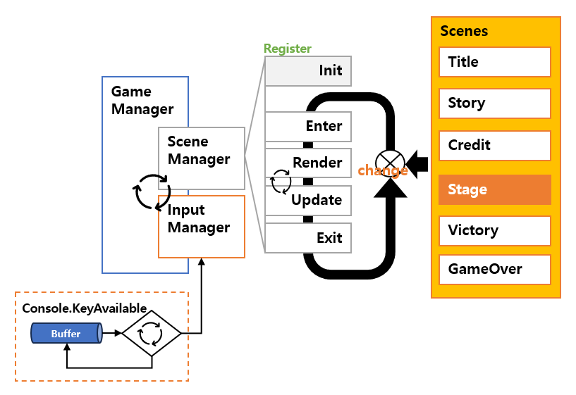
- 강의 시간에 진행한 Statefule Design을 이용한 Framework 를 그대로 사용.
- `InputManager` 에 `Console.KeyAvailable` 을 추가하여 `ReadKey`에서 Interupt 가 걸리지 않도록 추가.
  - 실시간 동작을 위함.
- FPS(Frame per second) 제어를 위해 time delay (`Thead.Sleep`) 추가.
- 모든 Scene 은 ScneneManager 를 통해 등록.
  - 등록시 Init 과정 진행
- Scene 자체를 State 로 관리하며 State 변경시 `Enter`->`Render`->`Update`->`Exit`순으로 동작하게 됨.
- 단, `Render`와 `Update`는 Scene 내에서 반복적으로 발생할 수 있으므로 `Render`와 `Update`와 사용자 입력인 `InputManager`가 포함된 `Loop`가 기본적인 EventLoop 의 형태로 갖게됨.

### In StageScene
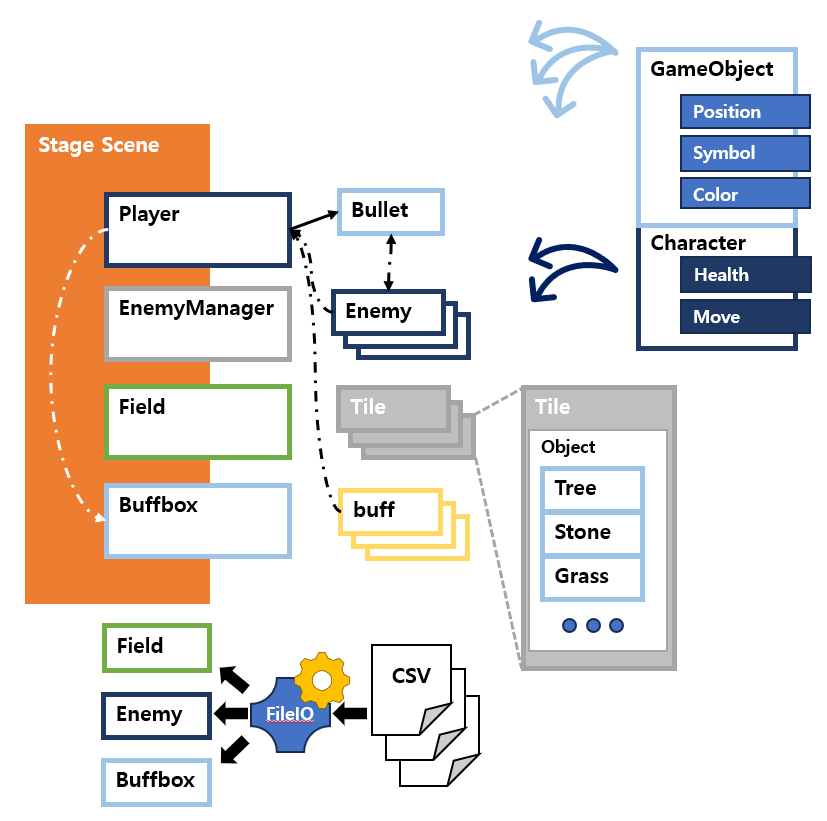
- 실제 게임이 구동되는 Scene.
- 크게 `Player`, `EnemyManager`, `Field`, `BuffBox`를 관리.
  - `Player`; 유저가 직접 제어하는 객체. 이동, `BuffBox`메뉴 선택, 총알 발사등 유저가 직접 제어해야 하는 모든 기능에 대한 권한 및 구현이 되어있음.
    - `Bullet`; `Player`가 발사한 총알 객체. `Player`의 제어에 의해 `생성`됨.
  - `EnemyManager`; 적 객체에 대한 관리를 맡고 있는 객체. 적의 맵 위 팝업, 적의 상태에 따른 객체수 등을 관리.
    - `Enemy`; 적 개체. 플레이어를 따라 다니는 움직임 구현. `Player` 및 `Bullet`과의 상호작용.
    - **※ 적이 따라오는 알고리즘 구현**: [문서 링크](/docs/traceToPlayer.md)
  - `Field`; 맵 객체. 2차원 배열이며, item 은 `Tile`객체로 이뤄져있음.
    - `Tile`; 맵의 1칸에 해당하는 객체이며, 각 칸의 현재 `GameObject`와 처음 존재한 `GameObject`를 백업하여 지니고 있음.
  - `Buffbox`; 맵 위에 존재하게 될 버프 제공 박스 개체. `Buff`에 대한 관리.
    - `Buff`; `Player`의 능력치에 도움을 주는 내용으로, `player`와 상호작용.
- 하늘색 네모는 `GameObject`를 상속.
- 청색 네모는 `Character`를 상속. 단 `Character` 는 `GameObject`를 상속 받고 있음.
- `Field`, `Enemy`, `Buffbox`관련 데이터는 `CSV`로 별도 관리고 있음.
  - 별도로 구현된 Loader 를 통해 각각 필요한 데이터 제공.

## Snapshot
### Title
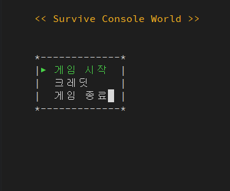

### Credits
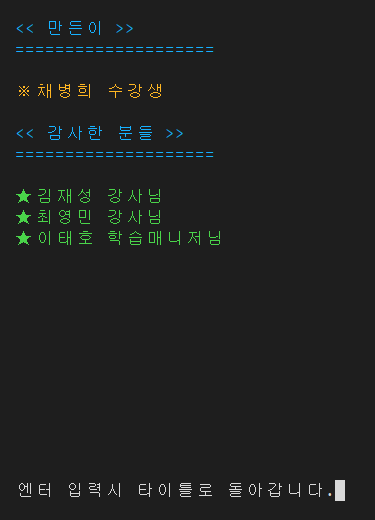
- 화면이 아래에서 위로 움직임.
- 완전히 멈추면 "엔터 입력시~~" 가 뜨며 씬간 이동 가능.

### 조작법
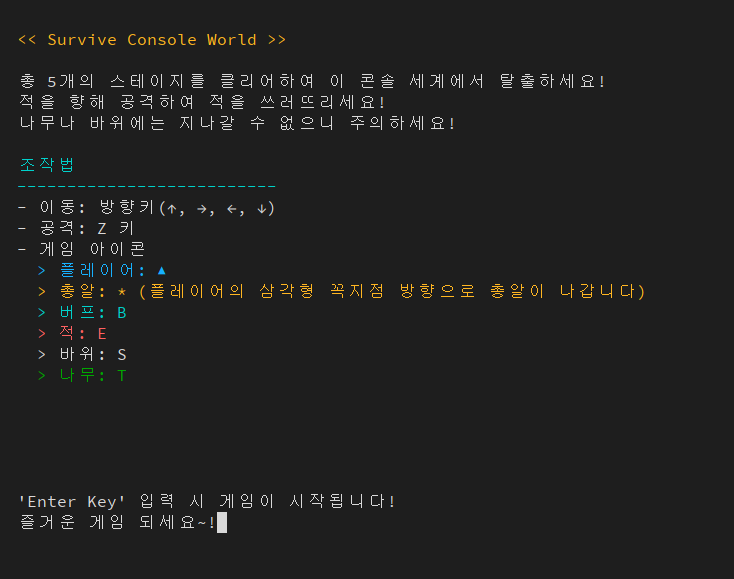

### 게임 화면
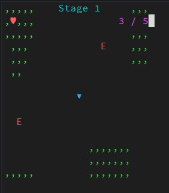
- 좌측위: 플레이어 생명력
- 가운데: 스테이지 번호
- 우측위: 맵상 적 개체수 / 스테이지별 총 적 개체수

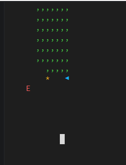
- Z키 입력시 위 화면과 같이 총알 발생
- 적`E`는 플레이어를 지속적으로 쫒아옴.

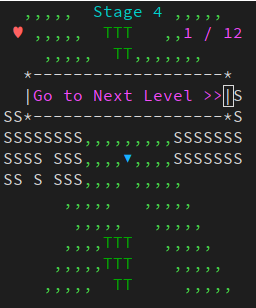
- 해당 스테이지 클리어시 위 화면 출력.
- 약 3초뒤 다음 스테이지로 이동.

### 스테이지 구성
#### Stage 1.
 
#### Stage 2.
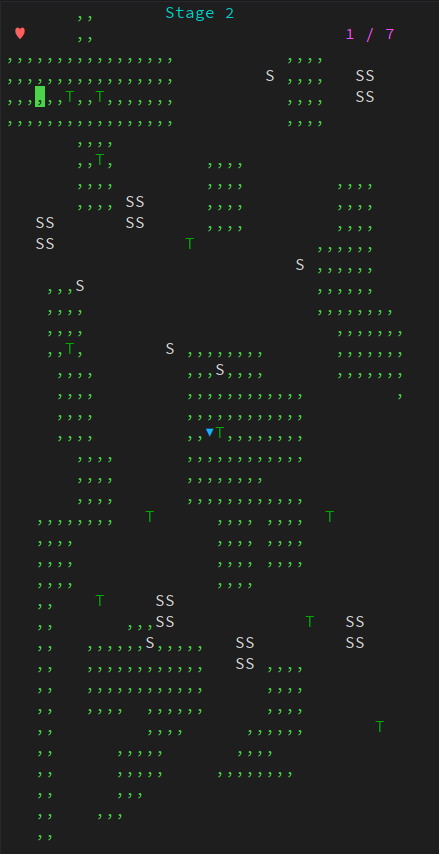 
#### Stage 3.
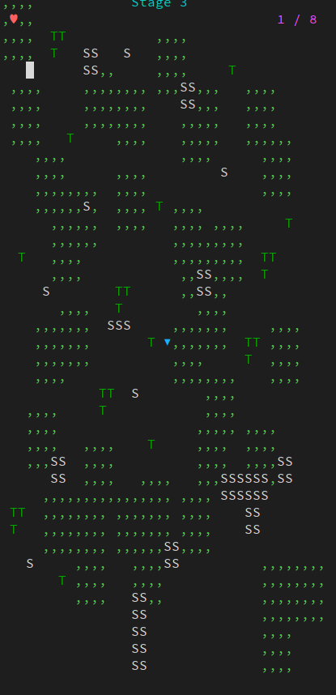 
#### Stage 4.
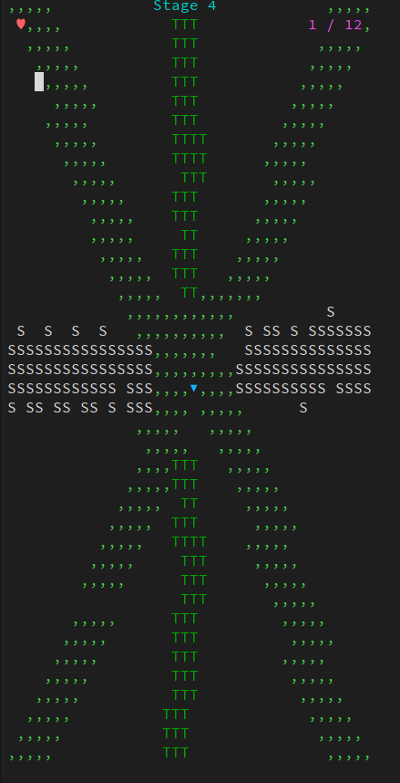 
#### Stage 5.
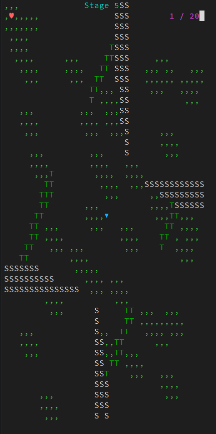

### 게임 오버
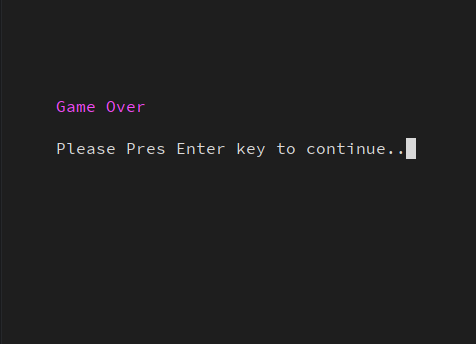

### 게임 승리
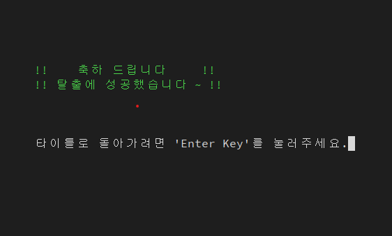

# 남은 이슈
https://github.com/Kyungil-smart/04-oop-console-project-mybeang/issues

