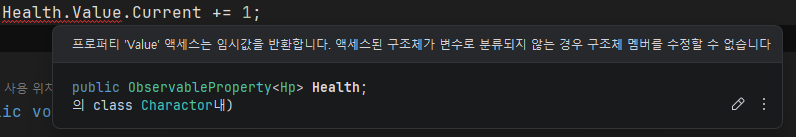

# File 입출력
- [MSDN 링크](https://learn.microsoft.com/ko-kr/dotnet/api/system.io.file.open?view=net-8.0)
- 맵 데이터를 code 에 넣기는 상당히 노가다와 어려움이 따름
  - Python Script 및 Excel 등을 이용하여 외부에서 얻은 CSV 데이터 생성.
- CSV 파일 읽기를 위해 조사.
- 파일을 직접 읽은 후 String을 Parsing 하는 Logic을 직접 구현하는 방향으로 설계.

# with 구문
- [MSDN 링크](https://learn.microsoft.com/ko-kr/dotnet/csharp/language-reference/operators/with-expression)
- 아래 그림과 같이 Delegate 로 선언한 객체내 변수를 수정하기 위해 조사 중 확인.
  - 
- 식은 with 지정된 속성과 필드가 수정된 피연산자의 복사본을 생성합니다. 개체 이니셜라이저 구문을 사용하여 수정할 멤버와 새 값을 지정합니다.
  - 즉, 객체에 직접 데이터를 수정하는 것이 아니라, 복사본을 만들어 수정된 값을 넣고 객체 자체를 교환하는 것.
- 솔직히 좋은 방식은 아닌 느낌을 강하게 받음. 
  - 해당 값의 변화는 직접적으로 값이 닿을 수 있는 곳에서 하는 것이 옮을 것 같기 때문.
  - 현재 구조상으로는 아직 어렵다고 판단. 일단 쉬운 방향으로 구현 후 나중에 리팩토링 하기로 결정.