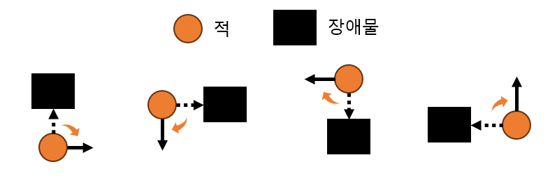

# 플레이어 추적 알고리즘
## 코드 위치
`GameObject / Charactors / Enemey.cs` 
`class Enemy / FindNxPos()`

## How to
### 기본 동작
- 기본 컨셉은 상대에 맞춰 `(자석의 극성처럼)` 내가 가야할 곳을 무조건 따라 가는 것이다.
  

- 위 그림과 같이 플레이어와 적 캐릭터 간 좌표의 Diff 를 구해 경우의 수에 맞춰 동작하게 된다.
  - 1,2,3,4 는 적 대비 플레이어가 대각선 위치에 있는 경우이다. 이 경우, 각 경우에 수에 맞춰 4방향 중 하나로 움직이게 된다.
    - 단, 본 코드에서는 상하 움직임을 우선적으로 두었다.
  - 5,6,7,8 은 적 대비 플레이어가 x나 혹은 y축으로 동일 선상에 존재하는 경우이다.
    - 4방향의 우선순위가 따로 없기 때문에 가던 방향에 대해서만 신경쓰면 된다.

### 추가 동작

- 미로에서 왼손법칙과 비슷하다.
- 적이 장애물을 만났을 경우, 시계방향으로 회전하도록 하였다. 

## 장점
- Loop 문을 사용할 필요가 없어 O(1)의 연산 속도를 보장한다.
- 간단하게 구현이 가능하다.

## 단점
- 앞에 장애물이 있을 경우 플레이어를 찾아올 수 없을 수도 있다
  - 오목한 장애물이 있는 경우 탈출 할 수가 없다. (있어도 한참 걸린다.)

## 고찰
- x/y 축에 대한 혼란으로 적이 찾아오다가 갑자기 도망가는(?)경우가 자주 발생했다.
  - 올바른 연산 혹은 방향을 넣지 않아 발생한 이슈이다. 
- BFS/DFS 적용은?
  - 고려하였으나, 적이 많아질 수록 많은 연산을 해야 한다. (연산량보다는 연산 속도가 문제)
  - 적의 움직임을 Thread 나 Async 등으로 적용한다면 연산 속도는 많이 줄어들 것으로 생각된다.
  - 아직 C# 에서 Multithread 의 경험이 없어 이번 콘솔 프로젝트에서는 진행하지 않았다.
  - 또한, Multithread 를 사용하게 되면 근본적인 구조를 많이 고쳐야할 것으로 예상되어 일정상 진행하지 않은 부분도 있다.
